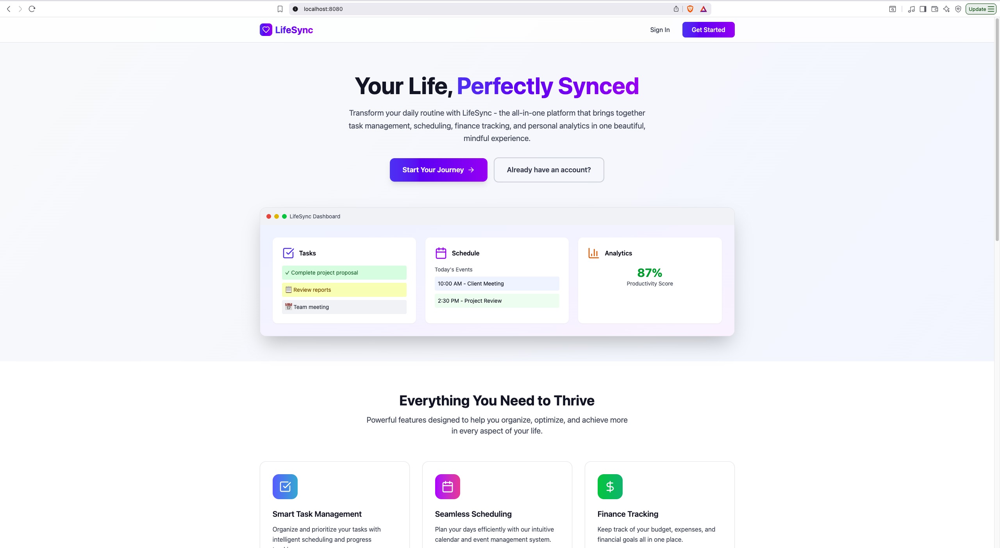
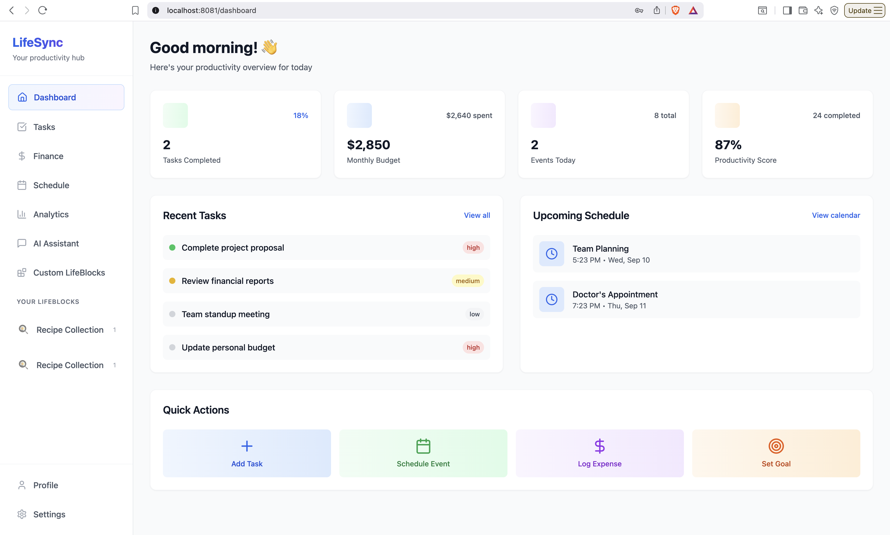
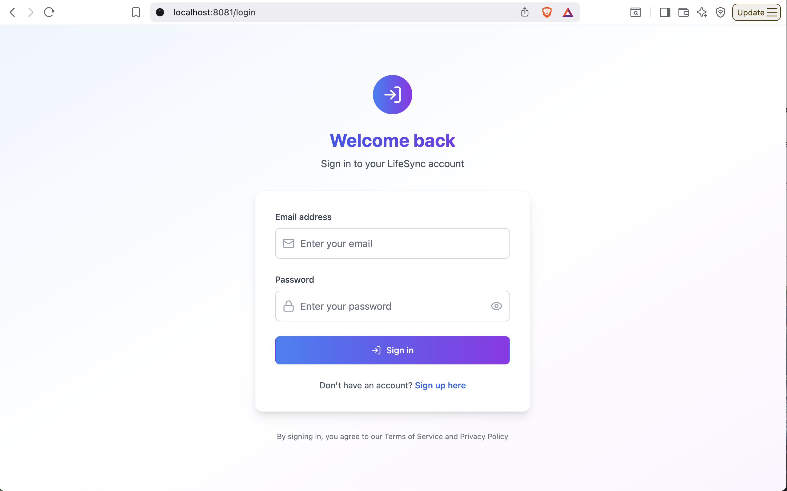

# LifeSync: A Mindful Living & Life Management Platform



*The clean and modern homepage featuring the landing page with navigation to signup and login*

A modern, customizable life management platform built with React, Flask, and MongoDB. Create custom "LifeBlocks" to organize and track different aspects of your life - from reading lists to fitness goals to recipe collections.

## 🚀 Features

- **Custom LifeBlocks**: Create personalized productivity categories
- **Task Management**: Add, track, and manage tasks with priorities and due dates
- **Schedule Management**: Create and manage events with calendar view
- **Financial Tracking**: Monitor expenses, budgets, and financial goals
- **Goal Setting**: Set and track progress on personal and professional goals
- **User Authentication**: Secure signup, login, and profile management
- **Real-time Dashboard**: Overview of all your productivity metrics
- **Responsive Design**: Works seamlessly on desktop and mobile devices

## 📸 Screenshots

Here's a glimpse of LifeSync in action:

### Main Dashboard

*The main dashboard provides an at-a-glance overview of your tasks, schedule, finances, and goals, with quick actions to add new items.*

### Sign-in Page

*Secure sign-in page for new and returning users.*

## 🛠️ Tech Stack

### Frontend
- **React 18** with TypeScript
- **Vite** for fast development and building
- **TailwindCSS** for modern styling
- **Shadcn/ui** for UI components
- **Lucide React** for icons

### Backend
- **Flask** (Python web framework)
- **MongoDB** for database
- **PyMongo** for database operations
- **JWT** for authentication
- **Flask-CORS** for cross-origin requests

### DevOps
- **Docker** and **Docker Compose** for containerization
- **MongoDB** containerized database

## 📦 Quick Start with Docker (Recommended)

The easiest way to run LifeSync is using Docker Compose, which sets up the entire application stack including MongoDB, backend API, and frontend.

### Prerequisites
- [Docker](https://docs.docker.com/get-docker/) and [Docker Compose](https://docs.docker.com/compose/install/)

### 1. Clone the Repository
```bash
git clone <repository-url>
cd LifeSyncProject
```

### 2. Start the Application
```bash
# Start all services (MongoDB, Backend, Frontend)
docker-compose up --build

# Or run in background
docker-compose up -d --build
```

This will:
- Start MongoDB on port `27017`
- Start the Flask backend on port `5001`
- Start the React frontend on port `8080`
- Automatically create sample data for testing

### 3. Access the Application
- **Frontend**: http://localhost:8080
- **Backend API**: http://localhost:5001
- **Test Account**: 
  - Email: `john.doe@example.com`
  - Password: `password123`

### 4. Stop the Application
```bash
docker-compose down

# To also remove volumes (database data)
docker-compose down -v
```

## 🔧 Development Setup with Docker

For development with live reloading and debugging:

```bash
# Start development environment
docker-compose -f docker-compose.dev.yml up --build

# Or run in background
docker-compose -f docker-compose.dev.yml up -d --build
```

This development setup includes:
- Hot reloading for both frontend and backend
- Volume mounting for live code changes
- Debug mode enabled for Flask

## 📦 Manual Installation (Alternative)

If you prefer to run without Docker:

### Prerequisites
- Node.js (v18 or higher)
- Python 3.8+
- MongoDB

### 1. Clone the Repository
```bash
git clone <repository-url>
cd LifeSyncProject
```

### 2. Install MongoDB
```bash
# On macOS with Homebrew
brew tap mongodb/brew
brew install mongodb-community

# Start MongoDB
brew services start mongodb/brew/mongodb-community
```

### 3. Set Up Backend
```bash
cd mindful-living-backend

# Install Python dependencies
pip3 install -r requirements.txt

# Initialize database with sample data (optional)
python3 init_user_db.py

# Start the Flask server
python3 app.py
```
The backend will run on `http://127.0.0.1:5001`

### 4. Set Up Frontend
```bash
cd mindful-living-central

# Install dependencies
npm install

# Start the development server
npm run dev
```
The frontend will run on `http://localhost:8080`

## 🎯 Usage

### User Authentication
1. Visit http://localhost:8080
2. Sign up for a new account or use the test account:
   - Email: `john.doe@example.com`
   - Password: `password123`

### Key Features
- **Dashboard**: Overview of all your productivity metrics
- **Tasks**: Create, manage, and track tasks with priorities
- **Schedule**: Add events and view them in a calendar layout
- **Finance**: Track expenses, manage budgets, and monitor financial goals
- **Goals**: Set personal and professional goals with progress tracking
- **Custom LifeBlocks**: Create personalized productivity categories

### Creating a LifeBlock
1. Navigate to "Custom LifeBlocks" in the sidebar
2. Click "Create LifeBlock"
3. Define your LifeBlock:
   - Name and description
   - Icon and color
   - Content types with custom fields
4. Start adding content to your new LifeBlock!

### Example LifeBlocks
- **📚 Reading Journey**: Track books with title, author, rating
- **🏃‍♂️ Fitness Goals**: Log workouts with exercise, duration, intensity
- **🍳 Recipe Collection**: Store recipes with ingredients, instructions, difficulty

## 🔧 API Endpoints

### Life Blocks
- `GET /life_blocks` - Get all life blocks
- `POST /life_blocks` - Create a new life block
- `PUT /life_blocks/<id>` - Update a life block
- `DELETE /life_blocks/<id>` - Delete a life block

### Content Management
- `POST /life_blocks/<id>/contents` - Add content to a life block
- `PUT /life_blocks/<id>/contents/<content_id>` - Update content
- `DELETE /life_blocks/<id>/contents/<content_id>` - Delete content

## 🗃️ Database Schema

### LifeBlock Collection
```javascript
{
  _id: ObjectId,
  name: String,
  description: String,
  icon: String,
  color: String,
  contentTypes: [{
    id: String,
    name: String,
    icon: String,
    fields: [{
      id: String,
      name: String,
      type: String, // 'text', 'number', 'date', 'boolean', 'select', 'textarea'
      required: Boolean,
      options: [String] // for select fields
    }]
  }],
  contents: [{
    id: String,
    contentTypeId: String,
    data: Object, // dynamic based on content type fields
    createdAt: Date,
    updatedAt: Date
  }],
  createdAt: Date,
  updatedAt: Date
}
```

## 🚀 Development

### Docker Development Environment
```bash
# Start development environment with hot reloading
docker-compose -f docker-compose.dev.yml up --build

# View logs
docker-compose -f docker-compose.dev.yml logs -f

# Stop development environment
docker-compose -f docker-compose.dev.yml down
```

### Manual Development Setup
1. Start MongoDB: `brew services start mongodb/brew/mongodb-community`
2. Start Backend: `cd mindful-living-backend && python3 app.py`
3. Start Frontend: `cd mindful-living-central && npm run dev`

### Building for Production
```bash
cd mindful-living-central
npm run build
```

## 🤝 Contributing

1. Fork the repository
2. Create a feature branch: `git checkout -b feature-name`
3. Commit your changes: `git commit -m 'Add some feature'`
4. Push to the branch: `git push origin feature-name`
5. Submit a pull request

## 📝 License

This project is licensed under the MIT License - see the LICENSE file for details.

## 🙏 Acknowledgments

- Built with [Shadcn/ui](https://ui.shadcn.com/) components
- Icons from [Lucide](https://lucide.dev/)
- Styled with [TailwindCSS](https://tailwindcss.com/)
